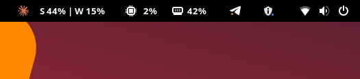
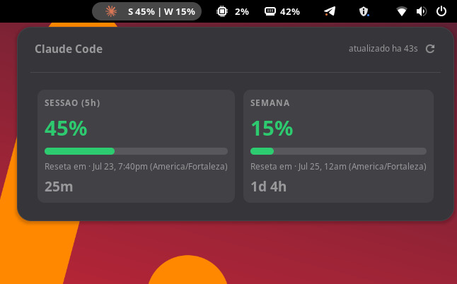

# Claude Status

GNOME Shell extension showing [Claude Code](https://claude.com/claude-code) usage (`/usage`) in the top bar: current session (5h) and weekly percentage, with countdown to reset.



Clicking the panel opens a detailed dropdown, including live [Claude status](https://status.claude.com) (operational / degraded / outage):



## Requirements

- GNOME Shell 45 to 50
- [Claude Code](https://claude.com/claude-code) installed and authenticated, with the `claude` binary in one of `~/.local/bin`, `/usr/local/bin`, `/usr/bin`, `/bin` or `/snap/bin`

## How it works

Every 5 minutes the extension runs `claude -p "/usage"` in the background — spawned directly, with no shell in between and an explicit `PATH` — parses the output (session and weekly percentage plus reset time), and updates the panel. It also polls `status.claude.com` on the same interval and shows a color-coded indicator (green/yellow/orange/red) in the dropdown, linking out to the status page on click.

The CLI is invoked with `--safe-mode --no-session-persistence --strict-mcp-config --tools ""`, so the process it spawns cannot run hooks, load MCP servers or plugins, read `CLAUDE.md`, use any tool, or write a session transcript — it can only report usage. `/usage` is answered locally without a model turn today, but the extension runs unattended against an authenticated account, so the boundary is enforced rather than assumed. If the installed CLI is too old to accept these flags, the dropdown says so and the extension stops rather than falling back to an unrestricted command.

If a `/usage` call fails or times out (25s watchdog), it retries with exponential backoff (15s, 30s, 45s... capped at 120s, up to 5 attempts) instead of leaving stale data on screen. No data is sent to third parties; everything runs locally through the Claude Code CLI itself, aside from the status page check.

## Installation

```bash
git clone https://github.com/montanhes/claude-status.git ~/.local/share/gnome-shell/extensions/claude-status@oakz.org
gnome-extensions enable claude-status@oakz.org
```

On Wayland, new extensions are only picked up after logout/login (GNOME Shell doesn't hot-reload). After logging back in, run the `gnome-extensions enable` command above.

## Packaging (EGO submission)

Run `./pack.sh` to build the `.shell-extension.zip` in `dist/`. It uses `gnome-extensions pack` with explicit `--extra-source`/`--podir`, so the archive only ever contains runtime files (`extension.js`, `metadata.json`, `stylesheet.css`, `icons/`, compiled `locale/*.mo`). Never zip the repo directory directly — that pulls in `.git/`, `.gitignore`, `screenshots/`, and `po/*.po`, which trip EGO-P-005/P-006 in review (checked with `shexli`).

## Localization

UI strings are translated via gettext. Currently available: English (default), Portuguese (pt_BR), Spanish, French, and German. Translations follow the system locale automatically.

## Structure

- `metadata.json` — extension metadata (uuid, version, shell compatibility)
- `extension.js` — core logic: panel, `/usage` parsing, dropdown, status.claude.com polling, retry/backoff handling
- `stylesheet.css` — styling for the dropdown cards and status indicator
- `icons/` — panel icon
- `po/` — translation files (`.po`) and template (`.pot`)

## License

MIT
